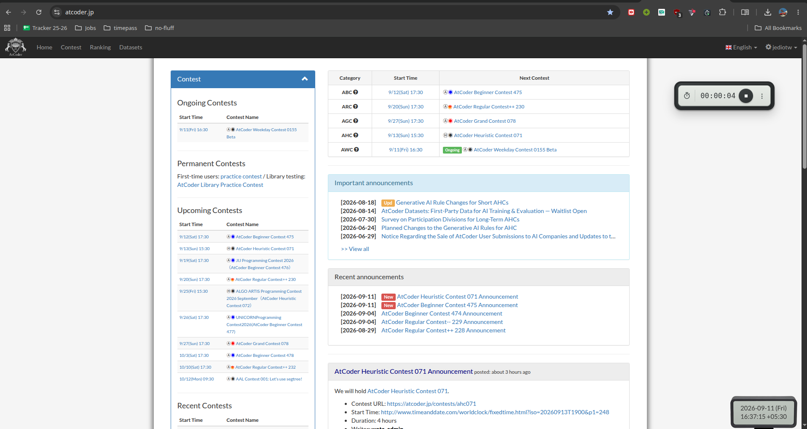
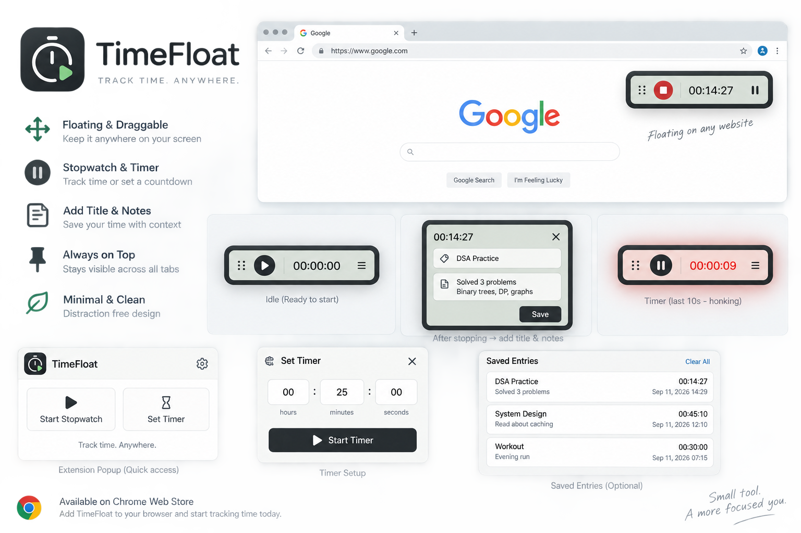

# ⏱️ Stopwatch+

> **Stopwatch+ — Track Time. Anywhere.**

A minimal floating stopwatch and timer for Chrome.

Stopwatch+ puts a small, distraction-free time tracker directly on the webpage you're using — perfect for coding, competitive programming, studying, debugging, watching videos, or any task where you want to know where your time is going.



---



## ✨ Features

### ⏱️ Stopwatch

Start a stopwatch directly from the floating widget.

```text
┌──────────────────────────┐
│ ⠿  ■  00:23:17        ⋮ │
└──────────────────────────┘
````

Click the stop button to finish the session.

---

### ⌛ Timer

Choose **Timer** from the idle screen and set a countdown.

```text
Hours    Minutes    Seconds

[ 00 ]   [ 05 ]     [ 00 ]

        [ Start ]
```

The final 10 seconds enter a warning state with a sound notification.

---

### 🎛️ Simple Idle Screen

When nothing is running, Stopwatch+ gives you two simple choices:

```text
┌──────────────────────────┐
│        ⏱️  │  ⌛         │
└──────────────────────────┘
```

* **Stopwatch** → starts a fresh stopwatch
* **Timer** → opens timer setup

No unnecessary menus or screens.

---

### 🌐 Carry the Timer Across Tabs

The timer isn't tied to a single webpage.

Start a timer on one tab and switch to another — the same timer keeps running.

```text
Tab 1                     Tab 2

Codeforces                Documentation
    │                          │
    └────── Same Timer ────────┘
              ↓
          00:42:18
```

This makes Stopwatch+ especially useful when your workflow requires switching between multiple websites.

---

### 📝 Save Tracked Time

When you stop a session, you can save it with a title and optional notes.

```text
┌──────────────────────────┐
│ Save tracked time        │
│                          │
│ [ Title                ] │
│ [ Notes (optional)...  ] │
│                          │
│                  [Save]  │
└──────────────────────────┘
```

Example:

```text
Title:
Codeforces - Segment Tree

Notes:
Got stuck implementing the segment tree.
Had to look up lazy propagation.
```

---

### 📚 Daily History

View your tracked sessions from the three-dot menu.

Only the current day's history is kept.

At local midnight, the previous day's history is automatically removed.

---

### 📤 CSV Export

Export your daily history as a CSV file.

The exported data includes:

```text
Title
Notes
Duration
Mode
Created At
```

This lets you keep a record of how you spent your time and analyze it later.

---

### 🖱️ Press-and-Hold Dragging

The widget can be placed anywhere on the webpage.

Press and hold a non-interactive part of the widget for about 180ms, then drag it.

```text
Press → Hold → Drag → Release
```

The position is saved and restored later.

Interactive elements such as buttons, menus, and form fields remain clickable.

The widget is also kept inside the visible viewport when the browser is resized.

---

### 🎨 Minimal Neumorphic UI

The floating widget uses a soft, tactile UI:

* Dark rounded bezel
* Subtle bevels
* Soft shadows
* Recessed display
* Raised controls
* Compact layout
* Minimal visual distraction

The widget is designed to feel like a small physical timer floating on your screen.

---

# 🎯 Real-World Use Cases

Stopwatch+ is built around a simple question:

> **Where did my time actually go?**

Here are two situations where it becomes particularly useful.

---

## 🎥 1. Track How Much Time You Actually Spend Watching YouTube

You open YouTube to watch something.

Start Stopwatch+.

Watch your videos.

When you're done, stop the timer and save the session.

```text
YouTube
   ↓
Start Stopwatch+
   ↓
Watch videos
   ↓
Stop
   ↓
Save
```

For example:

```text
Title:
YouTube

Duration:
01:24:37

Notes:
Watched system design videos
```

Instead of guessing how much time you spent watching YouTube, you have an actual record.

If you really care about your time, **measure it**.

---

## 💻 2. Track Coding Contest Problem-Solving Time Across Tabs

This is where the cross-tab timer becomes especially useful.

Imagine you're participating in a coding contest.

You start solving **Question 1**.

You decide to implement a segment tree.

Then you get stuck.

You don't remember the exact implementation, so you switch to another tab to look it up.

With many timer extensions, the timer is tied to the current page or tab.

With Stopwatch+, **the timer keeps running when you switch tabs.**

```text
                 Coding Contest
                       │
                       ▼
                Start Stopwatch
                       │
                       ▼
                  Question 1
                       │
                       ▼
                 Get stuck 😭
                       │
                       ▼
              Open another tab
                       │
                       ▼
             Look up Segment Tree
                       │
                       ▼
               Return to contest
                       │
                       ▼
                Same timer
                still running
                       │
                       ▼
                 Solve Question
                       │
                       ▼
                     Stop
                       │
                       ▼
                 Save + Notes
```

You can then record exactly how much time you spent on each problem.

```text
Question 1
Duration: 42:18

Notes:
Difficulty was implementing the segment tree.
Forgot the lazy propagation implementation.


Question 2
Duration: 27:43

Notes:
DP transition was straightforward.


Question 3
Duration: 01:13:05

Notes:
Spent most of the time finding the observation.
```

Later, open **History** and export everything as CSV.

This gives you more than just a timer.

You get a record of:

* How long each problem took
* Which problems consumed most of your time
* What difficulty you faced
* What you had to look up
* Notes about your solving process

Over time, this can help you understand your actual problem-solving speed and where you struggle.

---

# 🏆 Competitive Programming

Stopwatch+ is particularly useful during contests and practice sessions.

You can use it with:

* Codeforces
* LeetCode
* AtCoder
* HackerRank
* CodeChef
* Other online judges

For example:

```text
Problem A → 08:21
Problem B → 17:43
Problem C → 42:18
Problem D → 01:13:05
```

Because the timer continues across tabs, you can freely switch between:

```text
Contest
   ↕
Documentation
   ↕
Editorial
   ↕
Code
   ↕
Search
```

without losing your timing session.

---

# 👨‍💻 Development

Track time spent on:

* Debugging
* Implementing a feature
* Reading documentation
* Fixing a bug
* Learning a new technology
* Investigating an issue

Example:

```text
Title:
Fix authentication bug

Duration:
01:17:32

Notes:
Found the issue in token refresh logic.
```

---

# 📖 Studying

Use the stopwatch when you want to measure how long you actually study.

Or use the timer when you want a fixed study session.

```text
Start Timer
    ↓
45 minutes
    ↓
Study
    ↓
Timer finishes
```

---

# 📊 Understand Where Your Time Goes

Stopwatch+ follows a simple workflow:

```text
        TRACK
          ↓
        SAVE
          ↓
       ANNOTATE
          ↓
        REVIEW
          ↓
        EXPORT
```

The goal isn't to turn Stopwatch+ into a complicated productivity platform.

It's simply to give you a reliable answer to:

> **"How much time did I actually spend on this?"**

---

## 🛠️ Tech Stack

* JavaScript
* HTML
* CSS
* Chrome Extension Manifest V3
* Chrome Storage API
* Chrome Alarms API
* Chrome Downloads API
* Shadow DOM

No backend.

No database.

No external server.

---

## 🏗️ Architecture

```text
                    Chrome Tab
                        │
                        ▼
               ┌─────────────────┐
               │    content.js   │
               │                 │
               │ Floating Widget │
               └────────┬────────┘
                        │
                        │ Messages
                        ▼
               ┌─────────────────┐
               │  background.js  │
               │                 │
               │ Timer State     │
               │ Stopwatch State │
               │ History         │
               └────────┬────────┘
                        │
                        ▼
               ┌─────────────────┐
               │ chrome.storage  │
               └─────────────────┘
```

### `content.js`

Responsible for:

* Floating widget
* UI rendering
* Stopwatch controls
* Timer controls
* Dragging
* History interface
* Session saving
* CSV export

### `background.js`

Responsible for:

* Timer state
* Stopwatch state
* Persistent storage
* Chrome alarms
* Timer completion
* Daily history cleanup
* Communication with content scripts

### `content.css`

Contains the widget styling.

The widget is rendered inside **Shadow DOM**, preventing most host-page CSS from interfering with Stopwatch+.

---

## 📁 Project Structure

```text
Stopwatch+/
│
├── manifest.json
├── background.js
├── content.js
├── content.css
├── README.md
│
├── media/
│   ├── image.png
│   └── screenshot.png
│
└── icons/
    ├── icon16.png
    ├── icon32.png
    ├── icon48.png
    └── icon128.png
```

---

# 🚀 Installation

Stopwatch+ can currently be installed as an unpacked Chrome extension.

### 1. Clone the repository

```bash
git clone https://github.com/jediotw/stopwatch-plus.git
cd stopwatch-plus
```

### 2. Open Chrome Extensions

Go to:

```text
chrome://extensions
```

### 3. Enable Developer Mode

Enable:

```text
Developer mode
```

### 4. Load the extension

Click:

```text
Load unpacked
```

Select the Stopwatch+ project directory.

### 5. Open a webpage

Open any HTTP/HTTPS webpage.

The floating Stopwatch+ widget will appear automatically.

---

# 🔒 Privacy

Stopwatch+ is designed to work locally.

There is:

* ❌ No account
* ❌ No backend
* ❌ No analytics
* ❌ No external server
* ❌ No cloud database

Timer state and history are stored locally using Chrome's extension storage.

Your tracked sessions stay on your device unless you explicitly export them.

---

# 🧠 Design Philosophy

Stopwatch+ follows one simple principle:

> **The timer should stay out of your way.**

It isn't trying to become another giant productivity dashboard.

No:

* Complicated task management
* Social features
* Productivity scores
* Distracting dashboards
* Unnecessary notifications

Just a small timer that is available whenever you need it.

---

# 🗺️ Roadmap

The project is intentionally kept small.

Possible future improvements:

* [ ] Keyboard shortcuts
* [ ] Improved accessibility
* [ ] Better timer controls
* [ ] More export options
* [ ] Chrome Web Store release

Features that add unnecessary complexity will intentionally be avoided.

---

# 🤝 Contributing

Found a bug or have an idea?

Feel free to open an issue or submit a pull request.

Feedback from competitive programmers and developers is especially welcome.

---

# ⭐ Feedback

If you use Stopwatch+ while solving problems, studying, developing, or tracking your screen time, I'd love to hear how you use it.

Especially if you use:

* Codeforces
* LeetCode
* AtCoder
* CodeChef
* GitHub
* YouTube
* Other coding or learning platforms

---

# 📜 License

MIT License
